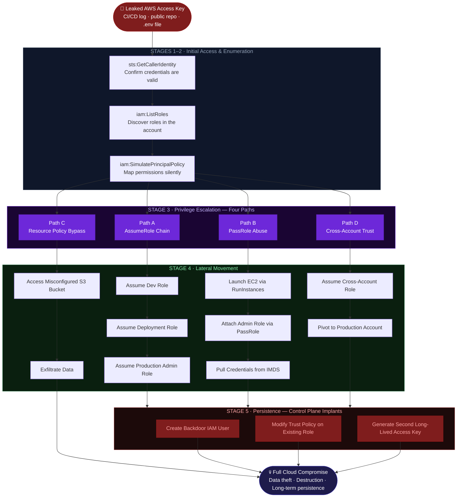

# IAM Attack Path Diagram

> This diagram models a complete AWS identity-driven compromise across six stages.
> No software vulnerability is exploited. Every step abuses legitimate AWS mechanisms — misconfigured by accident, traversed by design.

---

## Full Attack Path — Six Stages



---

## Stage Breakdown

### Stage 1 — Initial Access

The attack begins with valid credentials. The attacker has not exploited anything yet.

| Leak Source | How It Happens |
|---|---|
| Public GitHub repository | Access keys committed to source code or `.env` files |
| CI/CD build logs | Credentials printed in pipeline output |
| Developer dotfiles | Keys stored plaintext in `~/.aws/credentials` on a compromised machine |
| Exposed S3 bucket | Configuration files accessible via misconfigured bucket policy |

---

### Stage 2 — Enumeration

The attacker maps the environment before moving. This stage is designed to be silent:

```bash
# Verify credentials are valid
aws sts get-caller-identity

# Discover all roles in the account
aws iam list-roles --output table

# Simulate permissions without performing actions
aws iam simulate-principal-policy \
  --policy-source-arn arn:aws:iam::123456789012:user/dev-user \
  --action-names sts:AssumeRole iam:PassRole iam:CreatePolicyVersion
```

`iam:SimulatePrincipalPolicy` is a read-only call that returns a complete permission map. **Most detection tooling does not alert on it.** Enumeration frequently completes without triggering a single alert.

---

### Stage 3 — Privilege Escalation

**Path A — AssumeRole Chain**

The compromised identity has `sts:AssumeRole` on a role with broader permissions. That role may chain further:

```
dev-user → AssumeRole → DeploymentRole → AssumeRole → ProductionAdminRole
```

```bash
aws sts assume-role \
  --role-arn arn:aws:iam::123456789012:role/ProductionAdminRole \
  --role-session-name escalation-session \
  --duration-seconds 3600
```

**Path B — PassRole Abuse**

`iam:PassRole` allows injecting a privileged role into a compute service. Combined with `ec2:RunInstances`:

```bash
aws ec2 run-instances \
  --image-id ami-0abcdef1234567890 \
  --instance-type t2.micro \
  --iam-instance-profile Name=AdminProfile

# Inside the instance:
curl http://169.254.169.254/latest/meta-data/iam/security-credentials/AdminRole
```

The instance metadata returns full `AdministratorAccess` credentials. No direct role assumption was required.

**Path C — Resource Policy Bypass**

S3 bucket policies are evaluated independently of IAM identity policies:

```json
{
  "Effect": "Allow",
  "Principal": "*",
  "Action": "s3:GetObject",
  "Resource": "arn:aws:s3:::company-data/*"
}
```

`Principal: "*"` requires no IAM identity. The attacker bypasses the identity graph entirely.

**Path D — Cross-Account Trust**

```json
{
  "Effect": "Allow",
  "Principal": {
    "AWS": "arn:aws:iam::ATTACKER-ACCOUNT:root"
  },
  "Action": "sts:AssumeRole"
}
```

The attacker assumes this role from their own account. The source account generates no CloudTrail evidence.

---

### Stage 4 — Lateral Movement

With elevated privileges, the attacker expands across services and accounts:

- `Dev account` → `Shared Services` → `Production`
- Application role → Secrets Manager → Database credentials → downstream services
- Single account → full AWS Organization via management account trust

**Cross-account pivots are particularly dangerous:** CloudTrail is account-scoped. The originating account may show no suspicious activity.

---

### Stage 5 — Persistence

IAM persistence survives workload replacement and credential rotation because it lives in the **control plane**, not the data plane.

| Technique | Detection Difficulty |
|---|---|
| New IAM user with access keys | Moderate — most teams alert on `iam:CreateUser` |
| Rogue trust policy on existing role | High — the role itself looks legitimate |
| Second access key on existing entity | High — key rotation procedures often leave the backdoor key active |

**The detection signal:** `iam:UpdateAssumeRolePolicy` events in CloudTrail. Most teams monitor for new user creation. Few alert on trust policy modifications to roles that already exist.

---

### Stage 6 — Impact

| Category | Examples |
|---|---|
| Data exfiltration | S3 bulk download; RDS snapshot copy to external account |
| Ransomware | KMS CMK deletion; S3 objects deleted with versioning disabled |
| Cryptomining | Spot fleet launched across unrestricted regions |
| Persistent access | Backdoor user lies dormant for months before activation |
| Supply chain | Shared services compromise propagates to all consumer accounts |

---

## Defensive Questions

If any answer is *"I don't know"*, that is active attack surface:

1. Which identities have `sts:AssumeRole` on privileged roles?
2. Can any low-privilege identity reach admin via role chaining?
3. Where does `iam:PassRole` exist, and to which target role ARNs?
4. Which resource policies allow wildcard or external principals?
5. Are all cross-account trust relationships documented?
6. Would you detect `iam:UpdateAssumeRolePolicy` at 2 AM on a Saturday?
7. Would you detect a second access key created on an existing role?
8. Do your SCPs enforce what your IAM policies intend?

---

## AWS APIs Abused in This Attack Chain

| API | Stage | Attack Purpose |
|---|---|---|
| `sts:GetCallerIdentity` | Enumeration | Validate credentials silently |
| `iam:ListRoles` | Enumeration | Map available identity targets |
| `iam:SimulatePrincipalPolicy` | Enumeration | Full permission map without action |
| `sts:AssumeRole` | Escalation | Traverse the trust graph |
| `iam:PassRole` | Escalation | Inject role into compute for credential harvest |
| `ec2:RunInstances` | Movement | Launch instance with privileged profile attached |
| `iam:CreateUser` | Persistence | Backdoor identity creation |
| `iam:UpdateAssumeRolePolicy` | Persistence | Modify trust policy on existing role |
| `iam:CreateAccessKey` | Persistence | Generate second long-lived credential |

---

*Part of the [AWS IAM Attack Paths](../README.md) research project.*
