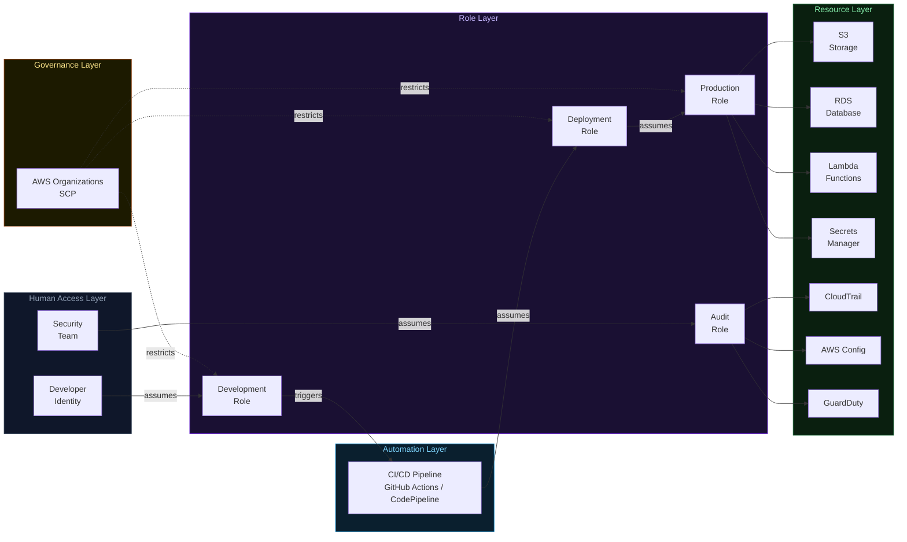
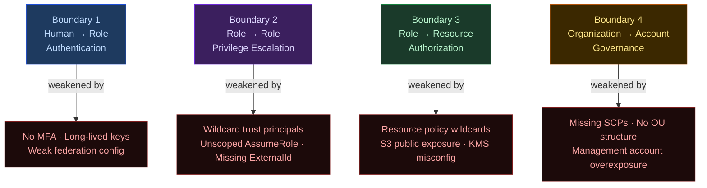

# IAM Trust Graph — Topology and Threat Model

> Most IAM diagrams show permissions.
> This diagram shows **trust relationships** — the edges that define who can become what.

---

## Trust Topology — Normal Operating State



---

## Trust Boundaries — Where Attacks Happen



---

## Trust Flow Analysis

### Boundary 1 — Human → Role (Authentication)

Human identities should never use long-lived IAM user credentials in modern AWS architectures. The correct model:

```
Human Identity
     ↓
Enterprise IdP (Okta, Azure AD, Google Workspace)
     ↓
SAML / OIDC Federation
     ↓
STS Temporary Credentials (15 min – 12 hours)
     ↓
Role Assumption
```

Controls that harden this boundary:
- MFA enforcement at the IdP level
- Short-duration STS sessions
- IP-based conditions on role trust policies
- Access analyzer to surface unused role assumptions

---

### Boundary 2 — Role → Role (Privilege Escalation Surface)

This is where most IAM attacks occur.

A role trust policy controls who (or what) can assume it. The most common misconfiguration:

```json
// Vulnerable: trusts the entire account (every identity)
{
  "Principal": {
    "AWS": "arn:aws:iam::123456789012:root"
  }
}

// Hardened: trusts only the specific pipeline role
{
  "Principal": {
    "AWS": "arn:aws:iam::123456789012:role/CICDDeploymentRole"
  },
  "Condition": {
    "StringEquals": {
      "sts:ExternalId": "unique-id-per-relationship"
    }
  }
}
```

The difference: the first trusts ~every identity in the account. The second trusts one specific role with a verified external ID.

**Every trust policy that references `:root` is granting account-wide assumption rights.**

---

### Boundary 3 — Role → Resource (Authorization)

Resource-based policies are evaluated **independently** of IAM identity policies. Both layers must be reviewed separately.

Common oversight: engineers audit IAM roles thoroughly, then deploy an S3 bucket with a policy that grants access independently of IAM. The role restriction is bypassed entirely.

```
IAM Identity Policy says: "Allow"
Resource Policy says:     "Allow to Principal *"
Effective result:         Anyone on the internet can access
```

This is why `aws s3api get-bucket-policy` should be in every security review checklist, regardless of IAM posture.

---

### Boundary 4 — Organization → Account (Governance)

Service Control Policies operate above IAM. They define what is **never permitted**, regardless of what IAM policies allow.

```json
{
  "Effect": "Deny",
  "Action": [
    "cloudtrail:DeleteTrail",
    "cloudtrail:StopLogging",
    "iam:CreateUser",
    "guardduty:DeleteDetector",
    "config:DeleteConfigRule"
  ],
  "Resource": "*",
  "Condition": {
    "StringNotEquals": {
      "aws:PrincipalArn": "arn:aws:iam::*:role/BreakGlassRole"
    }
  }
}
```

SCPs enforce invariants that IAM policies cannot: behaviors that should be impossible regardless of how permissive any single identity's policies are.

---

## CI/CD Pipelines — The Hidden Privilege Concentration Point

CI/CD systems are among the most dangerous privilege concentration points in AWS environments. They frequently have:

- `sts:AssumeRole` on deployment roles across multiple accounts
- `iam:PassRole` on application roles
- Access to secrets in Secrets Manager or Parameter Store

A compromised pipeline does not give an attacker one account. It gives them every environment the pipeline can deploy to.

Hardening requirements for CI/CD IAM:
- Use OIDC federation, not long-lived access keys stored as CI/CD secrets
- Scope deployment roles to specific actions and resource ARNs
- Separate deployment roles per environment (no single role deploys to both staging and production)
- Enable CloudTrail alerts on assumption of pipeline roles from unexpected principals

---

## Threat Modeling Questions

Before signing off on any IAM architecture, these must be answerable:

1. Which roles trust external principals? Are all of them documented?
2. What is the shortest path from any identity to production data?
3. Which services can assume privileged roles? Are those services hardened?
4. What is the blast radius if the CI/CD pipeline is compromised?
5. Which trust relationships have not been reviewed in the last 90 days?
6. Is there an SCP preventing CloudTrail from being disabled?
7. Would you detect a new cross-account trust relationship added at 2 AM?

The unanswered questions define the attacker's roadmap.

---

## Core Insight

> AWS environments are not secured by permissions.
>
> They are secured by carefully designed **trust relationships** — a directed graph where every edge is a deliberate choice, and every unreviewed edge is a potential attack path.
>
> The primary objective of IAM architecture is not to grant access.
> It is to **control how identities evolve into privileges** across the cloud environment.

---

*Part of the [AWS IAM Attack Paths](../README.md) research project.*
